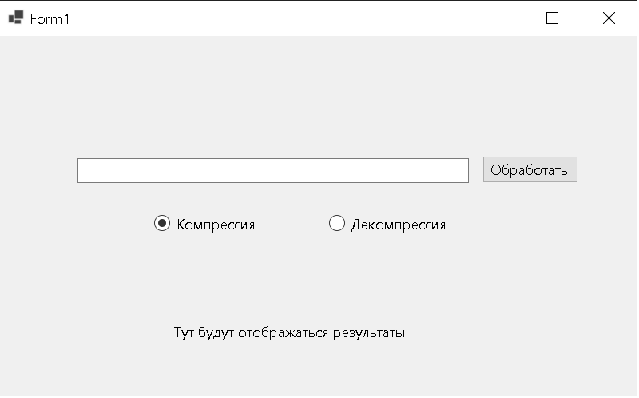
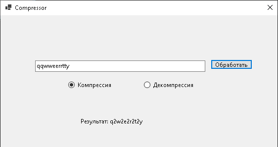
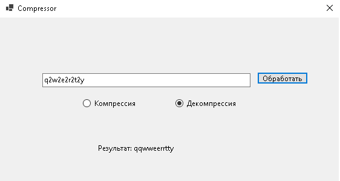
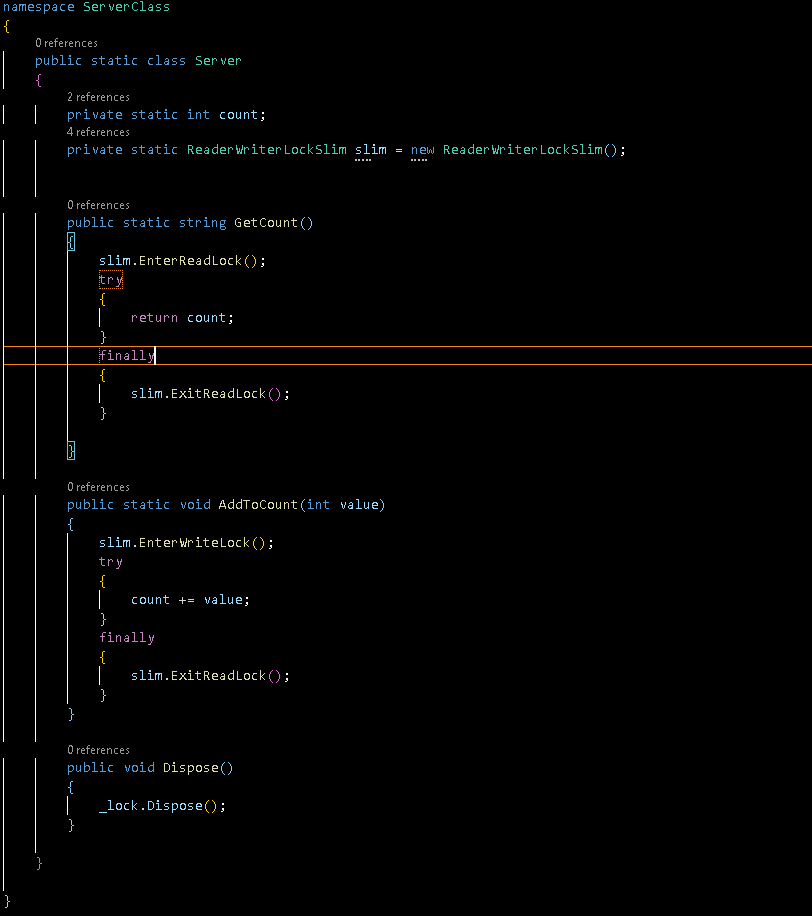
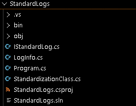

# TestTask-CleverenceSoft
Это выполненное тестовое задание от Клеверенс Софт
____________________________________________________________________________
## 1 ЗАДАНИЕ
**Задание:** 
Дана строка, содержащая n маленьких букв латинского алфавита. Требуется реализовать
алгоритм компрессии этой строки, замещающий группы последовательно идущих
одинаковых букв формой "sc" (где "s" – символ, "с" – количество букв в группе), а также
алгоритм декомпрессии, возвращающий исходную строку по сжатой.
Если буква в группе всего одна – количество в сжатой строке не указываем, а пишем её
как есть.

**Решение:**
Я решил данную задачу ввиде программы Windows Form.

1) Компрессия строки

2) Декомпрессия строки

### Реализация
В проекте есть файл "CompessLibrary.cs", в этой библеотеки есть статический класс "CompressClass" и два inner-метода "Compression" и "Decompression".

Чтобы использовать эту библиотеку, нужно прописать "using CompessLibrary;"

____________________________________________________________________________
## 2 ЗАДАНИЕ
**Задание:** 
Есть "сервер" в виде статического класса.
У него есть переменная count (тип int) и два метода, которые позволяют эту переменную
читать и писать: GetCount() и AddToCount(int value).
К классу–"серверу" параллельно обращаются множество клиентов, которые в основном
читают, но некоторые добавляют значение к count.
Нужно реализовать статический класс с методами GetCount / AddToCount так, чтобы:
1) читатели могли читать параллельно, не блокируя друг друга;
2) писатели писали только последовательно и никогда одновременно;
3) пока писатели добавляют и пишут, читатели должны ждать окончания записи.

**Решение:**
Использовал ReaderWriterLockSlim.

____________________________________________________________________________
## 3 ЗАДАНИЕ
**Задание:** 
Консольная программа для стандартизации лог-файлов
Эта программа предназначена для обработки лог-файлов, содержащих записи в двух
разных форматах. Цель программы – привести все записи к единому, стандартному виду,
упрощая анализ и обработку логов.
Необходимо преобразовать записи из входного лог-файла в единый формат и сохранить
их в выходной файл.

**Решение:**
Существуют несколько скриптов:
1) Основной код - Program.cs
2) Абстрактный класс - LogFile.cs (Создал для хранения основной информации представленной от пользователя (сущность))
3) Интерфейс - IStandardLog.cs (Создал для наследование методов интерфейса (Действия сущности))
4) Скрипт, где происходит вся магия - StandardizationClass.cs

Структура:

____________________________________________________________________________